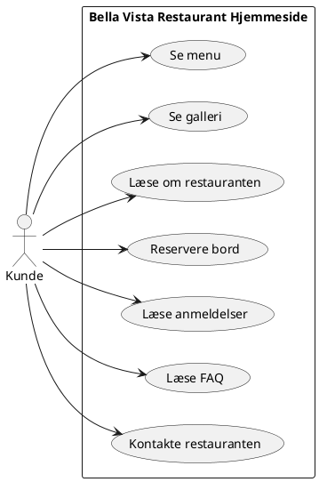
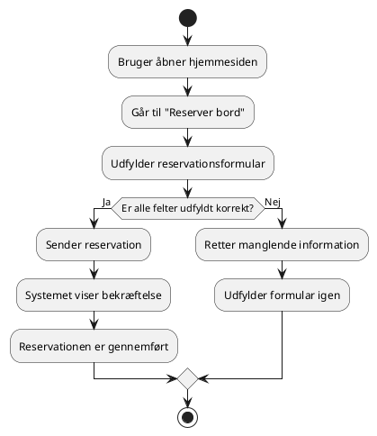

# UML-diagrammer

I projektet har vi valgt at bruge et Use Case-diagram og et Activity-diagram. Vi valgte disse to diagrammer, fordi de passer godt til en simpel hjemmeside, hvor brugeren især skal kunne se information og reservere bord.

## 1. Use Case-diagram

Use Case-diagrammet viser, hvad en kunde kan foretage på hjemmesiden.

\*Use case diagram kan vises ved at indsætte ovenstående Plantuml-kode i planttext.com.

### Forklaring

Kunden er den primære bruger af hjemmesiden. Kunden kan bruge siden til at finde information om restauranten, se menuen og reservere bord.

Vi har valgt et simpelt Use Case-diagram, fordi systemet ikke har login, database eller administratorfunktioner.

## 2. Activity-diagram for bordreservation

Activity-diagrammet viser processen for, hvordan en kunde reserverer et bord på hjemmesiden.

\*Activity-diagram kan vises ved at indsætte ovenstående Plantuml-kode i planttext.com.

### Forklaring

Diagrammet viser en simpel proces, hvor kunden går ind på reservationssiden, udfylder formularen og sender reservationen. Hvis der mangler information, skal brugeren rette det, før reservationen kan gennemføres.

Vi har valgt Activity-diagrammet, fordi det viser flowet i en konkret funktion på hjemmesiden.

---

# Projektplan

Denne projektplan viser, hvordan vi har arbejdet med Bella Vista Restaurant over tre uger. Vi har delt arbejdet op i tre faser, så projektet blev mere overskueligt.

## Roadmap

| Fase      | Periode               | Fokus                   | Hvad lavede vi?                                                                                                                                                                   | Output                                                                 |
| --------- | --------------------- | ----------------------- | --------------------------------------------------------------------------------------------------------------------------------------------------------------------------------- | ---------------------------------------------------------------------- |
| 🟠 Fase 1 | 24. april – 30. april | Koncept og Use Cases    | Vi fandt frem til idéen for løsningen og snakkede om, hvilke funktioner siden skulle have. Vi lavede også use cases for de vigtigste ting, som brugeren skal kunne gøre på siden. | ✅ Koncept for løsningen   ✅ Use cases for menu og bordreservation |
| 🔵 Fase 2 | 1. maj – 7. maj       | Design og HTML-struktur | Vi arbejdede med designet og begyndte at lave den grundlæggende HTML-struktur. Her lavede vi blandt andet forsiden, menuen og reservationsdelen.                                  | ✅ Designidé   ✅ HTML-struktur                                     |
| 🟢 Fase 3 | 8. maj – 14. maj      | CSS og dokumentation    | Vi arbejdede med CSS, så siden kom til at se bedre ud. Vi arbejdede med layout, farver og tekst. Til sidst lavede vi også dokumentation for projektet.                            | ✅ CSS-styling   ✅ Teknisk dokumentation                           |

## Kort opsummering

Planen hjalp os med at holde styr på projektet. Det gjorde det nemmere at se, hvad der skulle laves først, og hvad der kunne vente til senere.
